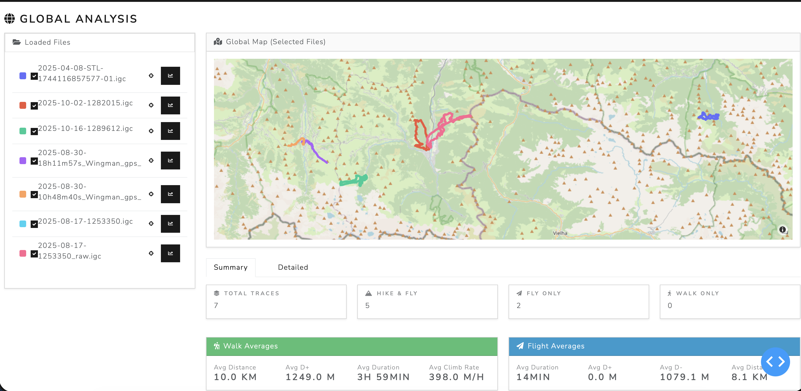
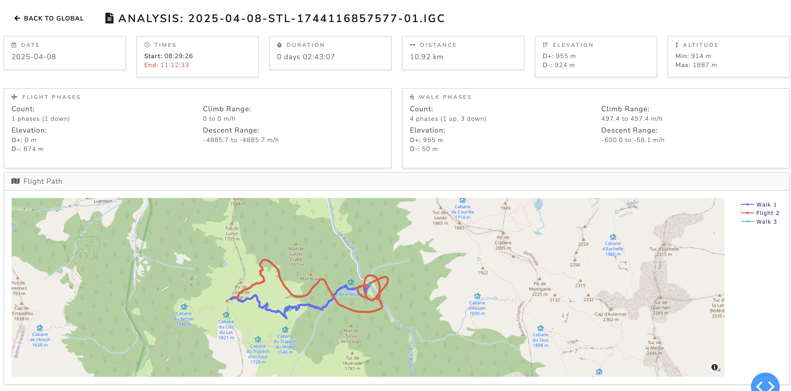
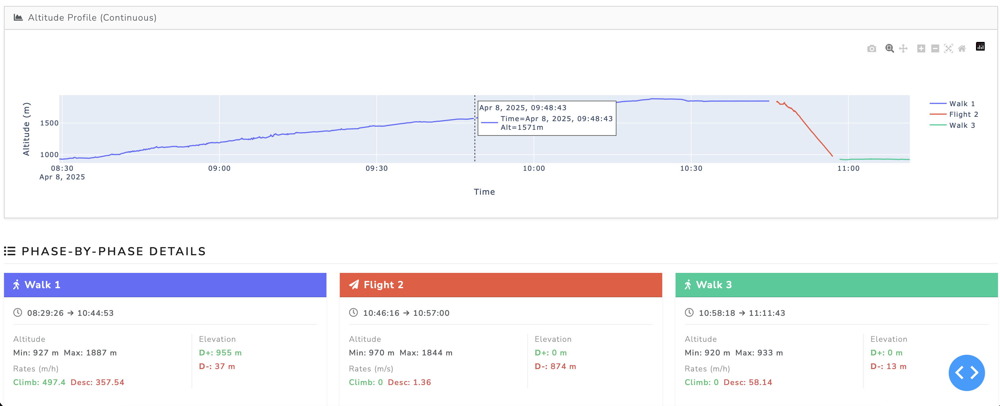

[](http://makeapullrequest.com)

[](https://www.gnu.org/licenses/gpl-3.0)


# HikeFlyKit (hfk)

**HikeFlyKit** is a paragliding tracking analysis tool designed specifically for **Hike & Fly** practitioners. It provides global performance insights for a collection of tracks and enabled to have a detailed view of each track.

Global view of a collection of tracks:


Track view (first part):


Track view (second part):


## Features
- **Intelligent Segmentation**: Automatically splits tracks into Walk and Flight phases using speed and vertical rate triggers.

## Limitations
- **IGC Format**: Currently only supports IGC files but the code is designed to be easily extended to support other formats.

---

## Getting Started

### 1. Prerequisites
Ensure you have **Python 3.8+** installed on your system.

### 2. Installation
We recommend using a virtual environment to manage dependencies:

```bash
# Create a virtual environment
python -m venv venv

# Activate it (macOS/Linux)
source venv/bin/activate

# Install dependencies
pip install -r requirements.txt
```

### 3. Launching the Dashboard
To start the interactive web dashboard, simply provide the path to one or more IGC files or a directory containing them:

```bash
# Analyze a whole directory
python main.py /path/to/your/igc/folder

# Analyze specific files
python main.py flight1.igc flight2.igc
```
The dashboard will be available at `http://127.0.0.1:8050/`.

---

## Python API Usage

HikeFlyKit is designed to be extremely easy to use as a library:

```python
from hfk import TrackCollection

# One-liner to load and analyze tracks
collection = TrackCollection(["./flight_logs/"])

# Get performance insights
for path in collection.tracks:
    stats = collection.get_global_stats(path)
    print(f"Track: {path}") 
    for key, value in stats.items():
        print(f"\t{key} : {value}")
```

---

## Dependencies
HikeFlyKit relies on the following major libraries:
- **Pandas**: Data manipulation and analysis.
- **Plotly & Dash**: Interactive visualizations and dashboard framework.
- **Pyproj**: Geodetic calculations for precise distance and speed ([Pyproj](https://pyproj4.github.io/pyproj/stable/index.html)).

---

## License
HikeFlyKit is free software: you can redistribute it and/or modify it under the terms of the GNU General Public License as published by the Free Software Foundation, either version 3 of the License, or (at your option) any later version. See the [LICENSE](LICENSE) file for details.

---

## Context
This project was initiated by [aherve4](https://github.com/aherve4) to gain precise insights into hiking and flying performance, helping pilots better understand their efficiency across different sessions and conditions.
